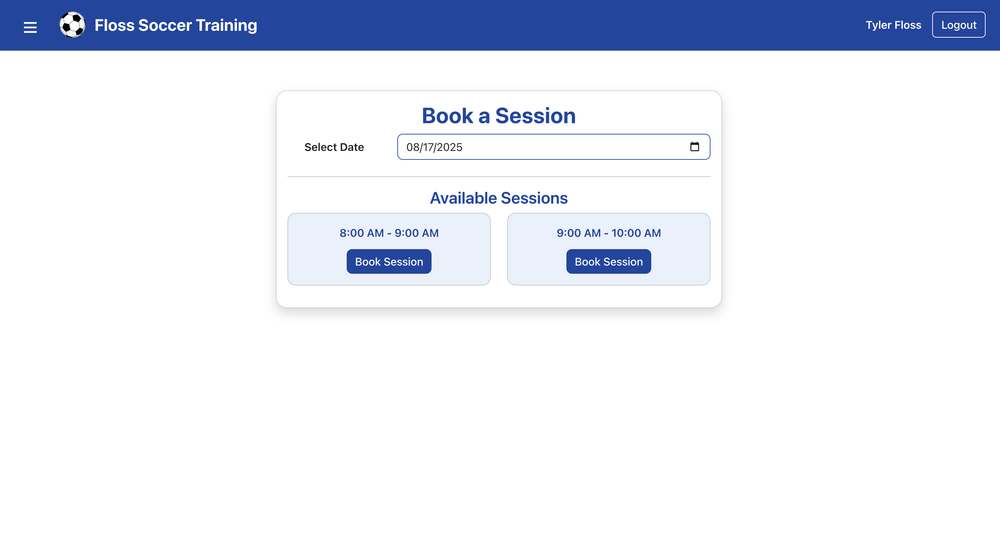

# Floss Training Frontend

## Overview

This is a React + Vite web application for managing and booking training sessions for parents and their children. The app features:

- Secure authentication using JWT cookies
- Profile setup and management for parents and children
- Session booking with location and pricing options
- Responsive, modern UI built with React Bootstrap

## Running Locally

1. **Clone the repository:**

   ```bash
   git clone https://github.com/tyler848484/floss-training-frontend.git
   cd floss-training-frontend/my-app
   ```

2. **Install dependencies:**

   ```bash
   npm install
   ```

3. **Start the development server:**

   ```bash
   npm run dev
   ```

4. **Access the app:**
   Open your browser and go to [http://localhost:5173](http://localhost:5173)

> **Note:** The app expects a backend running at `http://localhost:8000` for authentication and API requests.

## UI Screenshot

_Add your screenshot below:_



---

For any issues or questions, please contact the repository owner.
